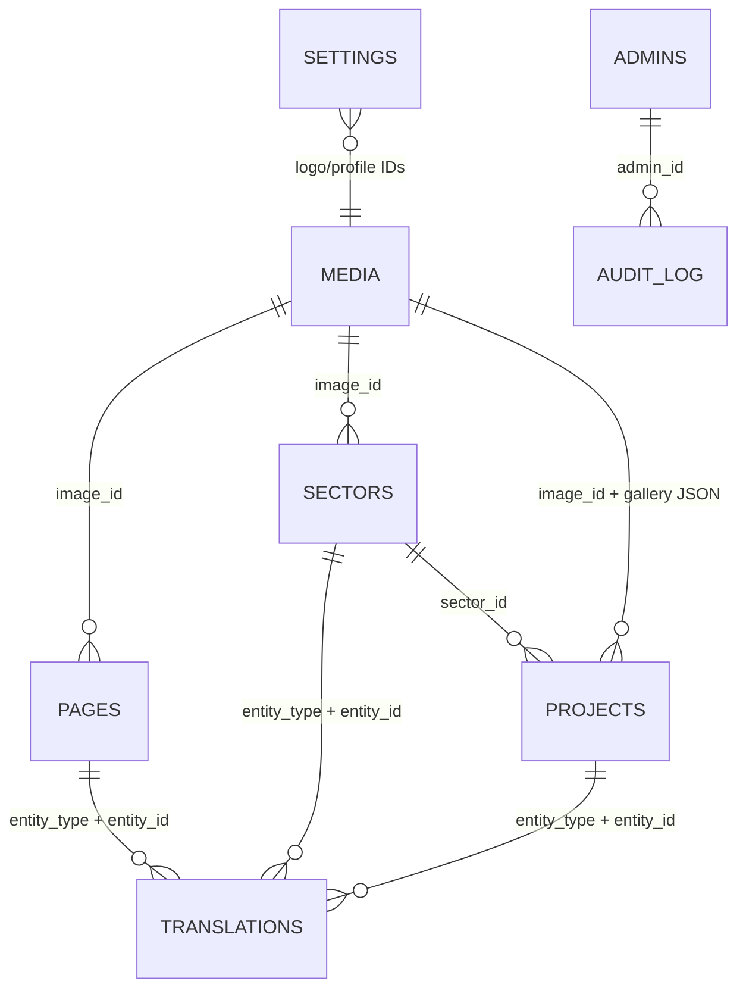

# البنية وآلية العمل

PHP يعرض الصفحات من MySQL باستخدام PDO وتحضير الاستعلامات الأصلي. أسماء الجداول الديناميكية مقيدة بقائمة ثابتة. المخرجات النصية تمر عبر `htmlspecialchars`؛ لا محرر HTML غير مقيد ولا تنفيذ قوالب يرفعها المستخدم. الواجهة خفيفة بلا إطار SPA.

الجداول: `pages`, `sectors`, `projects`, `translations`, `media`, `settings`, `admins`, `contact_messages`, `rate_limits`, `audit_log`.

`translations` جدول متعدد الكيانات، بمفتاح فريد `(entity_type, entity_id, locale)`. النوع محدود بـENUM، والوجود يُتحقق منه في التطبيق؛ لا FK متعدد الجداول لهذه العلاقة. `body` JSON يحوي الأقسام والقوائم. لكل قسم مفتاح قالب ثابت وترتيب وحالة ظهور. تظهر أقسام الصفحات في ترتيبها المحفوظ. المعرض JSON لمعرفات صور متحقق منها. FK قطاع المشروع يمنع مراجع قطاع غير موجودة.

## مسار رسالة التواصل

جلسة + CSRF ← تحقق خادم + حقل مصيدة + زمن معقول للنموذج + محدد طلبات ← INSERT ناجح في MySQL ← PRG ورقم مرجعي ← عامل بريد منفصل يحدّث حالة الإشعار. تكرار الرسالة يحجزه مفتاح بصمة فريد لكل بريد/نص/يوم. لا حفظ وهمي في localStorage ولا تأكيد قبل قاعدة البيانات.

محدد الدخول: خمس محاولات للحساب/15 دقيقة و15 لعنوان الاتصال/15 دقيقة. محدد التواصل: ست محاولات/15 دقيقة. المفاتيح HMAC ولا تخزن IP الخام في جداول التطبيق. عمليات التحديث في المحدد ذرية. عامل البريد ينظف المفاتيح المنتهية التي مضى عليها يوم؛ لذلك يجب تشغيله أو تنظيفها دورياً حتى عند تعطيل البريد. يمكن لمسؤول القاعدة تشغيل `DELETE FROM rate_limits WHERE expires_at < UNIX_TIMESTAMP() - 86400` دورياً.

## الإدارة والأمان

الجلسات تستخدم HttpOnly وSameSite=Lax وSecure في الإنتاج، وتجدد هوية الجلسة عند الدخول وتغيير كلمة المرور. كل تعديل POST يتطلب CSRF. المهلة 30 دقيقة خمول/8 ساعات مطلقة. تجزئة كلمة المرور بـPASSWORD_DEFAULT مع إعادة التجزئة عند الحاجة، وإنشاء أول مسؤول محصور بأداة CLI.

الملفات المرفوعة خارج جذر الويب، أسماء عشوائية، قائمة MIME/امتدادات وحجم/أبعاد محددة، وفك وإعادة ترميز الصور. لا يقبل SVG/ملفات تنفيذية. يُتحقق من MIME وامتداد PDF وتوقيع بدايته ونهايته؛ عارض PDF.js المحلي لا ينفذ إجراءات المستند. لا يمثل ذلك ماسح برمجيات خبيثة؛ المسؤول هو جهة الرفع الوحيدة. مسار الملفات يطبق نوع المحتوى وnosniff وترويسة CSP sandbox وطلبات Range. ملفات المشاريع المسودة غير المعتمدة لا تعرض للزائر ما لم تكن مستخدمة أيضاً في محتوى منشور آخر.

ترويسات CSP وX-Frame-Options وReferrer-Policy وPermissions-Policy، وHSTS في HTTPS. لا يعتمد الموقع على X-Forwarded-Host لبناء الروابط. وراء reverse proxy، عنوان محدد الطلبات افتراضياً هو REMOTE_ADDR؛ هيئ عنوان العميل على مستوى الخادم الموثوق، ولا تثق بترويسات يرسلها العميل عشوائياً.

## حدود مقصودة

هذه لوحة مالك واحدة الصلاحية، وليست نظام فرق متعدد الأدوار. لا حجوزات أو دفع أو إرسال ردود بريدية من اللوحة، ولا تحليلات أو ملفات تعريف تسويقية. لا مزامنة مع منصات خارجية. التشغيل يحتاج MySQL؛ لا يوجد وضع عرض ثابت يوهم بحفظ الرسائل عند تعطل القاعدة. يعرض التطبيق 503 عامة ويسجل الخطأ داخلياً عند تعطل الخدمة.
